# Exploring Ubuntu Firewall (UFW)


---

## Note  
If needed, to install a package in Ubuntu, we can use Advanced Package Tools (APT).  

```bash
sudo apt install <packagename>
```

---

## I. Enable UFW (Uncomplicated Firewall)

**Default UFW Policies**  
- Incoming: Denied (blocked) by default  
- Outgoing: Allowed by default  

---

### 1. Check the status of UFW
```bash
sudo ufw status
```
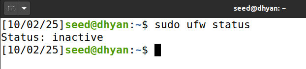

**Purpose:** Check whether UFW is currently active or inactive before applying any changes.  
**Tool Explanation:** The `ufw status` command displays the firewall’s current state along with any active rules.  
**Observation:** The result showed **inactive**, meaning the firewall wasn’t running at this stage.  

---

### 2. Allow SSH before enabling UFW
```bash
sudo ufw allow 22/tcp
```
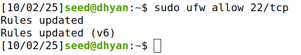

**Purpose:** Make sure turning on the firewall won’t block SSH connection.  
**Tool Explanation:** The `ufw allow` command adds a rule to let traffic through on a specific port (22/tcp for SSH).  
**Observation:** The rule for port 22 was added, so SSH will still work after enabling the firewall.  

**Question:** If you are remotely accessing your server, why is it important to allow traffic through port 22 before enabling UFW?  
**Answer:** If port 22 wasn’t allowed, SSH would be blocked immediately and remote access to the machine would be lost.  

---

### 3. Check open ports
```bash
sudo ss -tuln
```
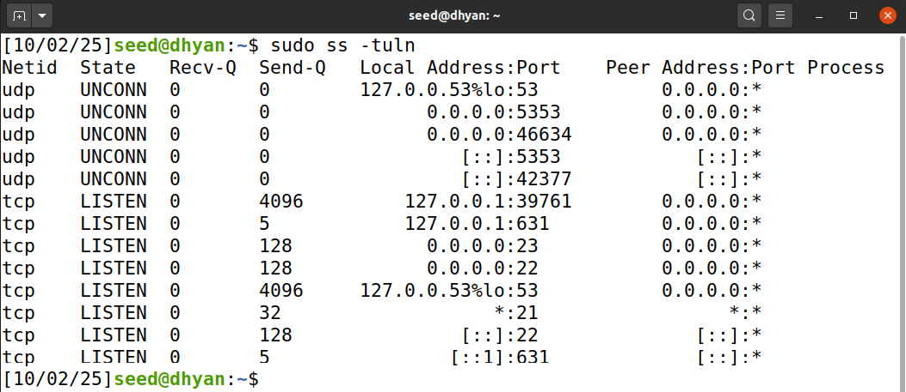

**Purpose:** List all services currently listening on TCP and UDP ports.  
**Tool Explanation:**  
- `-t` → TCP  
- `-u` → UDP  
- `-l` → Listening ports  
- `-n` → Numeric output  

**Observation:** Services were listening on ports 22 (SSH), 21 (FTP), 23 (Telnet), and 631 (printing). SSH was expected, but FTP and Telnet were surprising since they are outdated and insecure.  

---

### 4. Enable UFW
```bash
sudo ufw enable
```
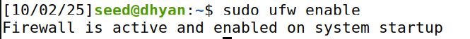

**Purpose:** Activate the firewall so that all rules take effect.  
**Observation:** UFW was enabled successfully and will automatically stay active after startup.  

---

### 5. Re-check status
```bash
sudo ufw status
```
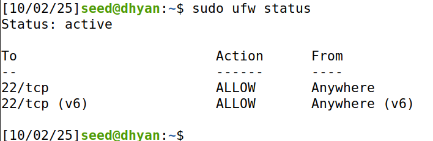

**Purpose:** Confirm that UFW is active and rules are applied.  
**Observation:** Firewall was active, with only SSH (22/tcp) allowed.  

---

### 6. Allow Web Server Ports
```bash
sudo ufw allow 80/tcp
sudo ufw allow 443/tcp
```
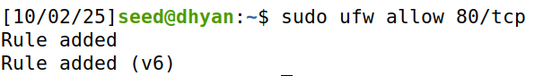
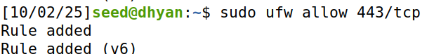

**Purpose:** Open HTTP (80) and HTTPS (443) ports for web server access.  
**Tool Explanation:**  
- Port 80 → HTTP (web traffic)  
- Port 443 → HTTPS (secure web traffic)  

**Observation:** Both ports showed as allowed, enabling web access.  

**Question:** If this is a web server, what ports do you need to open?  
**Answer:** Port **80** for HTTP and **443** for HTTPS.  

---

### 7. Verbose Status
```bash
sudo ufw status verbose
```
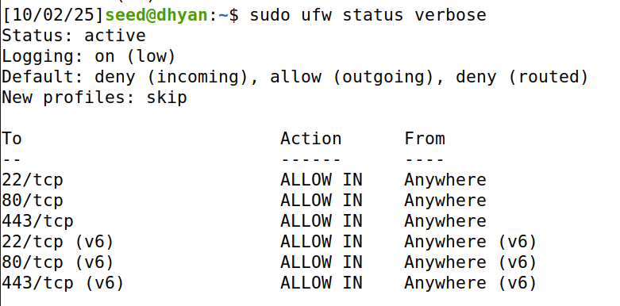

**Purpose:** Check firewall’s default policies, logging level, and all active rules.  
**Observation:** Default was **deny incoming, allow outgoing**. Logging was **low** (later increased). Rules (SSH, HTTP, HTTPS) displayed correctly.  

---

### 8. Block an IP Address
```bash
sudo ufw deny from 10.0.0.0
```
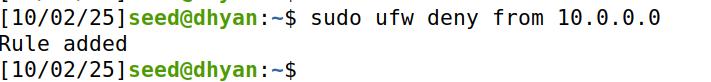

**Purpose:** Block all traffic from an untrusted IP.  
**Observation:** Deny rule for `10.0.0.0` was added successfully.  

---

### 9. Allow Specific IP on Port 587
```bash
sudo ufw allow from 192.168.1.50 to any port 587 proto tcp
```
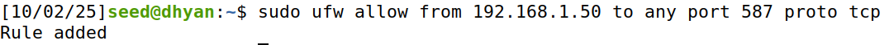

**Purpose:** Allow only a trusted host access to mail submission (SMTP) service.  
**Tool Explanation:** Port **587** is used for outgoing email submission by mail clients.  
**Observation:** Rule added successfully, restricting access to only `192.168.1.50`.  

**Question:** What is port 587 used for?  
**Answer:** Port **587** is the submission port for email. Mail clients use it to send outgoing messages to a mail server.  

---

### 10. Numbered Status
```bash
sudo ufw status numbered
```
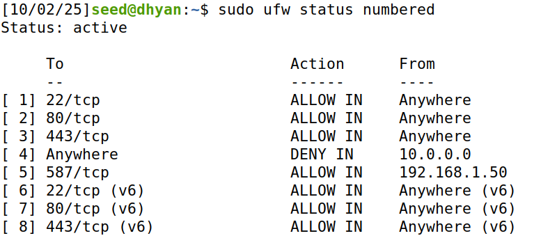

**Purpose:** Show rules with index numbers for easy deletion/modification.  
**Observation:** All rules listed with numbers for easier management.  

---

## II. Enable UFW Logging

---

### 1. Turn on Logging
```bash
sudo ufw logging on
```
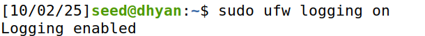

**Purpose:** Enable firewall logging for monitoring and troubleshooting.  
**Observation:** Logging enabled, activity recorded in `/var/log/ufw.log`.  

---

### 2. Set Logging Level to High
```bash
sudo ufw logging high
```
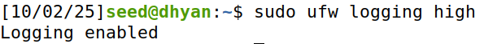

**Purpose:** Provide detailed logs for allowed and denied traffic.  
**Levels:**  
- Low → minimal  
- Medium → some detail  
- High → detailed (recommended)  
- Full → very verbose, includes kernel logs  

**Observation:** Logging set to **high** for detailed tracking.  

---

### 3. Monitor Logs in Real-Time
```bash
sudo tail -f /var/log/ufw.log
```
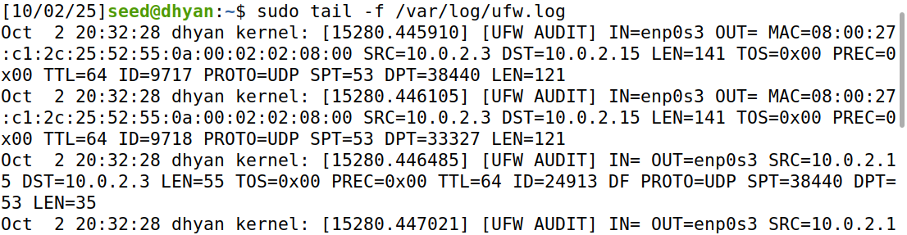

**Purpose:** View live firewall activity.  
**Observation:** Logs showed real-time source/destination IPs and ports. Stopped with `CTRL+C`.  

**Question:** Why is this information useful?  
**Answer:** It helps track network traffic and detect blocked or suspicious activity quickly.  

---

### 4. Filter Logs for Allowed Traffic
```bash
sudo grep 'ALLOW' /var/log/ufw.log
```
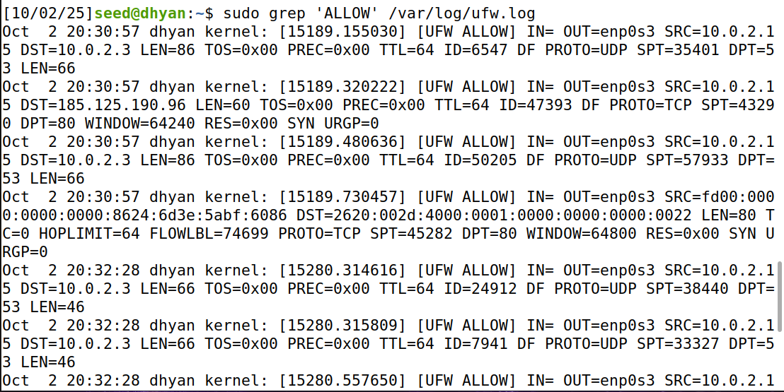

**Purpose:** Filter logs to show only allowed packets.  
**Observation:** Entries displayed for allowed traffic.  

---

### 5. Filter Logs for Denied Traffic
```bash
sudo grep 'DENY' /var/log/ufw.log
```
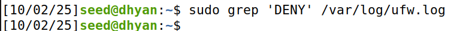

**Purpose:** Filter logs to show only denied packets.  
**Observation:** No DENY entries appeared, since nothing attempted to connect on blocked ports.  

**Question:** Is there any output for DENY? Why or why not?  
**Answer:** No DENY entries, because no blocked traffic occurred during testing.  

---

## Conclusion  

In this assignment, I explored the Uncomplicated Firewall (UFW) in Ubuntu and practiced managing firewall rules to control network traffic.  
Key takeaways include:  

- UFW defaults to **deny incoming** and **allow outgoing**, ensuring a secure baseline.  
- Allowing **port 22 (SSH)** before enabling UFW is crucial to avoid losing remote access.  
- Web servers typically require **ports 80 (HTTP)** and **443 (HTTPS)** to be open.  
- Specific services like **SMTP on port 587** should be restricted to trusted IPs.  
- Logging is an important tool for **monitoring traffic and detecting suspicious activity**.  
- The use of commands like `ufw status numbered`, `ufw logging high`, and `grep` filters provides more control and visibility over firewall behavior.  

Overall, this hands-on practice emphasized the importance of proper firewall configuration for maintaining system security, preventing unauthorized access, and ensuring that only necessary services are reachable.  

