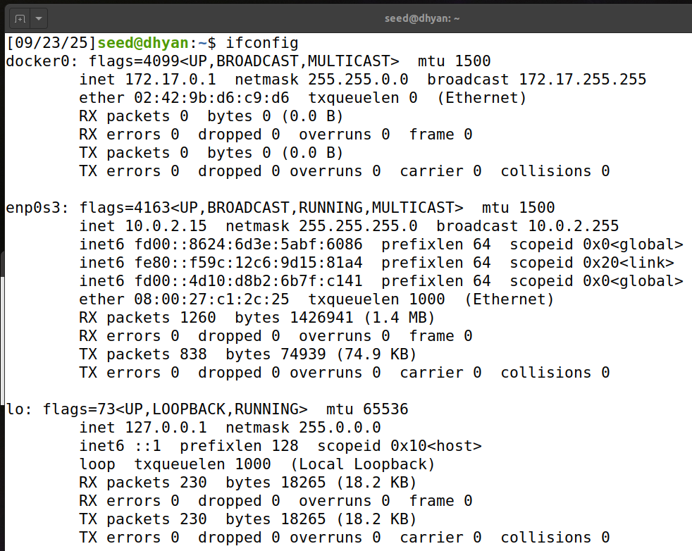
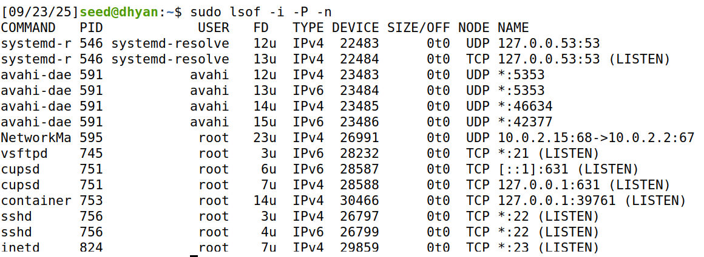
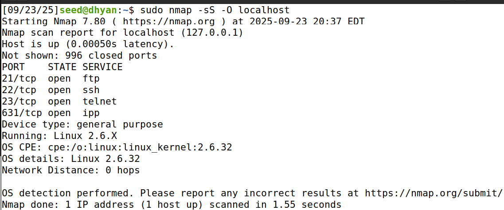
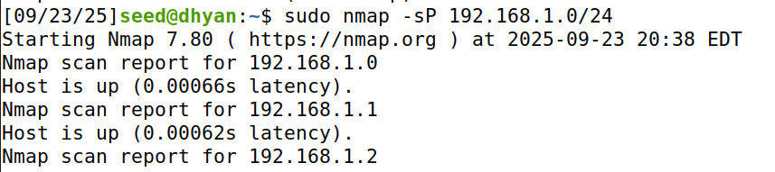
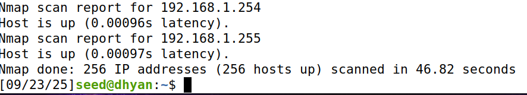
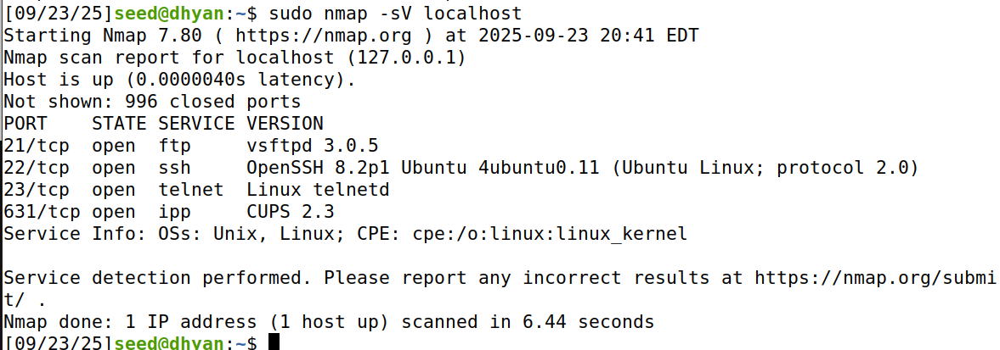
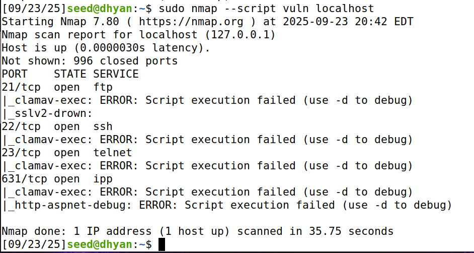
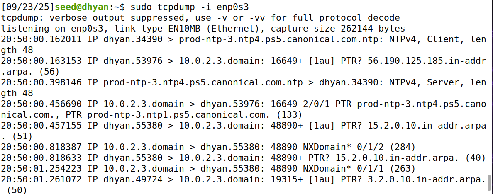
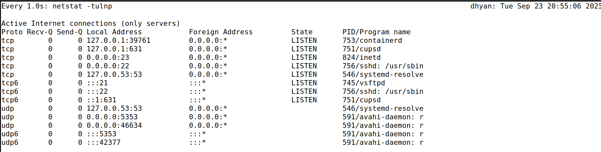
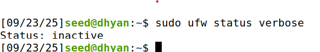

## 1. Identify Network Interfaces and IP Addresses

**Command:**
```bash
ip a
```
or
```bash
ifconfig
```


**Purpose:** This command shows you all the network interfaces on your server along with their IP addresses. It helps you see which interfaces are active and what their addresses are, making it easier to understand your server’s network setup.

**Tool Explanation:** `ip a` and `ifconfig` are utilities that provide detailed information about network interfaces, including their status (up or down), IP addresses, and more.

**NOTE:** You may have to install `net-tools` in order to run `ifconfig`. To do so, run the command:
```bash
sudo apt install net-tools
```

## 2. Check Open Ports

**Command:**
```bash
sudo netstat -tuln
```
or
```bash
ss -tuln
```


**Purpose:** This command lists all the open ports on your server along with the services using them. It helps you spot any unnecessary ports that might create security risks by serving as potential entry points for attackers.

**Tool Explanation:** `netstat` and `ss` show network connections, routing tables, interface statistics, masquerade connections, and multicast memberships. The `-tuln` options restrict the output to show only TCP (t) and UDP (u) ports in listening (l) state without resolving names (n).

## 3. Analyze Network Connections

**Command:**
```bash
sudo lsof -i -P -n
```


**Purpose:** This command shows all active network connections on your server. It helps you spot any unexpected or unauthorized connections that could indicate suspicious activity.

**Tool Explanation:** `lsof` stands for 'list open files'. With the `-i` flag, it lists all network files, including their associated processes. The `-P` and `-n` flags prevent the resolution of port numbers and IP addresses, making the output easier to read and faster to generate.

## 4. Perform Network Scanning with Nmap

**Command:**
```bash
sudo nmap -sS -O localhost
```


**Purpose:** This command scans your server to find open ports, detect running services, and identify the operating system. It helps you uncover any services that might be exposed without you realizing it.

**Tool Explanation:** Nmap (Network Mapper) is a powerful network scanning tool used to discover hosts and services on a network. The `-sS` option performs a stealth TCP SYN scan, and `-O` attempts to determine the operating system of the target.

**NOTE:** You will have to install Nmap. To do so, run:
```bash
sudo apt install nmap
```
Nmap can be a little slow on the VM, so some of the commands may take a bit to complete. Be patient!

## 5. Check for Open Ports on the Server's Network

**Command:**
```bash
sudo nmap -sP 192.168.1.0/24
```



**Purpose:** This command detects all active hosts on your local network. It helps you see which devices are connected and verify that no unauthorized devices are present.

**Tool Explanation:** The `-sP` option in Nmap is a Ping Scan, which discovers which hosts on a network are up without performing a port scan.

## 6. Check for Services and Versions

**Command:**
```bash
sudo nmap -sV localhost
```


**Purpose:** This command scans for open ports and checks the service and version running on each one. It helps you spot outdated or vulnerable software that may need to be updated.

**Tool Explanation:** The `-sV` option in Nmap enables version detection, providing detailed information about the services running on open ports.

## 7. Identify Potential Vulnerabilities

**Command:**
```bash
sudo nmap --script vuln localhost
```


**Purpose:** This command uses Nmap’s vulnerability scanning scripts to detect known security issues on the server. It helps you find common vulnerabilities in installed software.

**Tool Explanation:** Nmap has a scripting engine that allows for a wide range of scans. The `--script vuln` option runs scripts that check for various vulnerabilities.

## 8. Inspect Network Traffic

**Command:**
```bash
sudo tcpdump -i eth0
```


**Purpose:** This command monitors network traffic on a specific interface (e.g., enp0s3). It lets you watch traffic in real time and spot any suspicious activity or unusual patterns.

**Tool Explanation:** `tcpdump` is a packet analyzer that captures and displays packet headers of network traffic passing through a specified interface.

**NOTE:** To stop process, hit `ctrl+c` on your keyboard.

## 9. Monitor Network Connections in Real-Time

**Command:**
```bash
sudo watch -n 1 netstat -tulnp
```


**Purpose:** This command continuously monitors network connections, refreshing every second (`-n 1`). It allows you to track network activity in real time, such as new connections or services starting.

**Tool Explanation:** `watch` runs a specified command at regular intervals. In this case, it runs `netstat` to keep you updated about network connections in real time.

**NOTE:** To stop process, hit `ctrl+c` on your keyboard.

## 10. Check Firewall Rules

**Command:**
```bash
sudo ufw status verbose
```


**Purpose:** This command shows the current firewall rules on your server, including which ports and services are allowed or blocked. It helps you make sure that only the necessary ports are open.

**Tool Explanation:** `ufw` (Uncomplicated Firewall) is a front-end for managing iptables, designed to make it easier to configure a firewall. The `status verbose` option provides a detailed view of the current firewall configuration.

