# Network Security SIEM (Suricata + Promtail + Loki + LogCLI)

---

## Part 1 — Prepare System

### Commands
```bash
sudo apt update && sudo apt upgrade -y
sudo apt -y install curl jq unzip
curl -fsSL https://get.docker.com | sudo sh
sudo usermod -aG docker "$USER"
newgrp docker
sudo systemctl enable --now docker
docker --version
```
**Purpose:** Install required packages and Docker to set up the container environment.

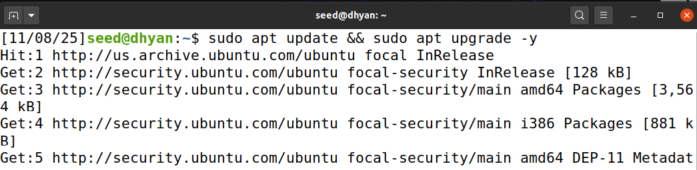
---
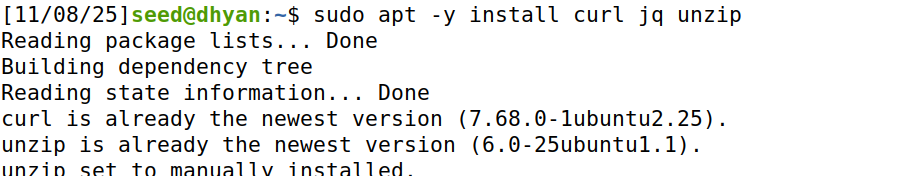
---
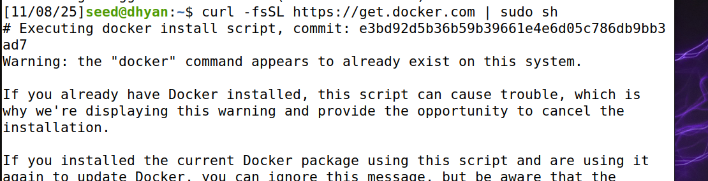
---
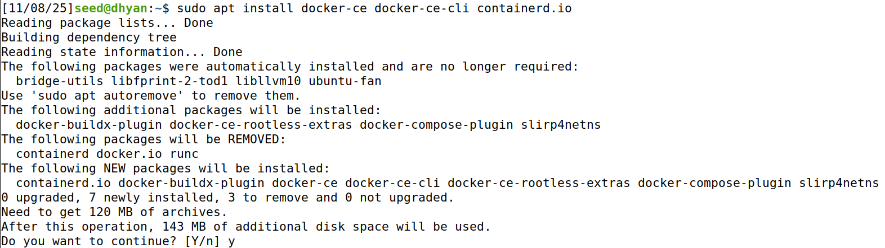
---
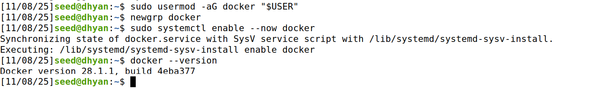

---

## Part 2 — Suricata (IDS/IPS)

### Install and Configure Suricata
```bash
sudo apt -y install suricata-update
sudo suricata-update
sudo mkdir -p /etc/suricata/rules
sudo touch /etc/suricata/rules/local.rules
ip -br a | awk '$1!="lo"{print $1, $3}'
```
**Purpose:** Install Suricata, update rules, and prepare configuration files.

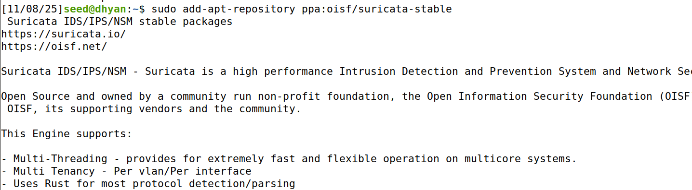
---
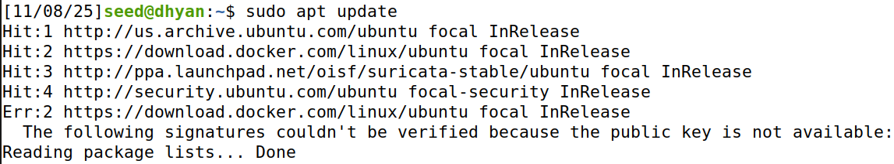
---
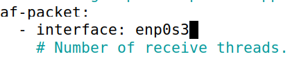

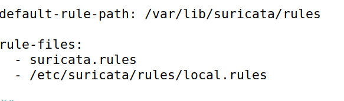


Edit `/etc/suricata/suricata.yaml` to include proper rule paths and network interfaces.

### Validate Configuration
```bash
sudo suricata -T -c /etc/suricata/suricata.yaml -v
```
**Purpose:** Validate Suricata configuration and rule paths.

**Q: Explain what the `-T`, `-c`, and `-v` flags do in the command above.**  
**Answer:**  
- `-T`: Tests the configuration without running Suricata.  
- `-c`: Specifies the configuration file to use.  
- `-v`: Enables verbose mode for detailed validation output.


### Run Suricata
```bash
sudo apt -y install suricata
sudo systemctl stop suricata
sudo suricata -i $(ip -br a | awk '$1!="lo"{print $1; exit}') -D
```
**Purpose:** Run Suricata in daemon mode on the main network interface.

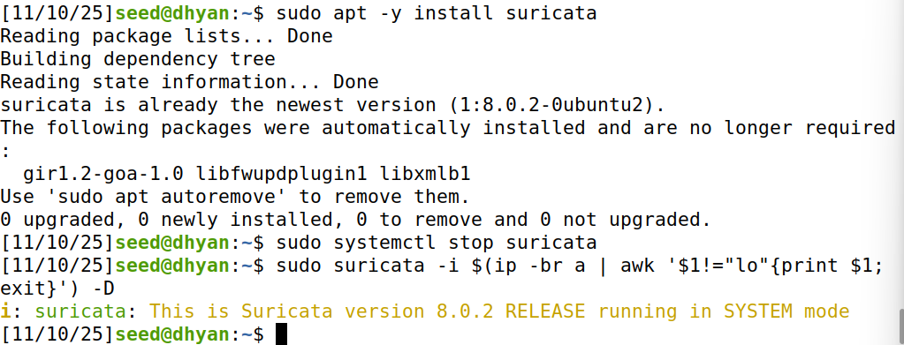

```bash
sudo tail -f /var/log/suricata/eve.json | jq .
```
**Purpose:** View real-time Suricata event logs in JSON format.

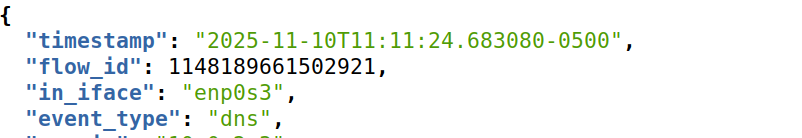

**Q1:** What types of events (fields under `"event_type"`) do you see in `eve.json`?  
**Answer:** Common event types include `flow`, `alert`, `http`, `dns`, `tls`, `fileinfo`, `ssh`, and `stats`.

---

## Part 3 — Loki (Central Log Store)

### Configure Loki
```bash
sudo mkdir -p /etc/loki /var/lib/loki/{chunks,rules}
cat <<'EOF' | sudo tee /etc/loki/loki-config.yml
auth_enabled: false
server:
  http_listen_port: 3100
common:
  path_prefix: /var/lib/loki
  storage:
    filesystem:
      chunks_directory: /var/lib/loki/chunks
      rules_directory: /var/lib/loki/rules
  replication_factor: 1
  ring:
    kvstore:
      store: inmemory
schema_config:
  configs:
    - from: 2020-10-24
      store: boltdb-shipper
      object_store: filesystem
      schema: v13
      index:
        prefix: index_
        period: 24h
EOF
sudo chown -R 10001:10001 /var/lib/loki
sudo chmod -R u+rwX /var/lib/loki
```
**Purpose:** Create configuration and directories for Loki with correct permissions.

Run Loki:
```bash
sudo docker run -d --name loki -p 3100:3100 \
  -v /etc/loki:/etc/loki \
  -v /var/lib/loki:/var/lib/loki \
  grafana/loki:2.9.8 -config.file=/etc/loki/loki-config.yml
```
**Purpose:** Start Loki as a containerized log database.

**Q2:** What port does Loki expose, and what API path receives log data?  
**Answer:**  
- Port: `3100`  
- API path: `/loki/api/v1/push`

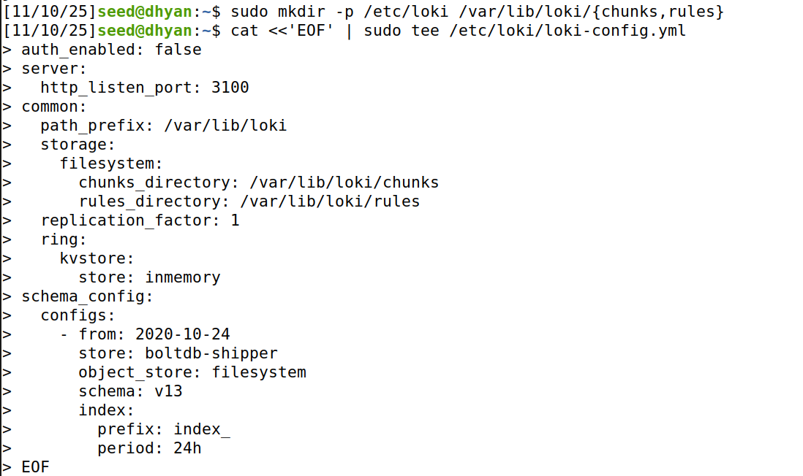

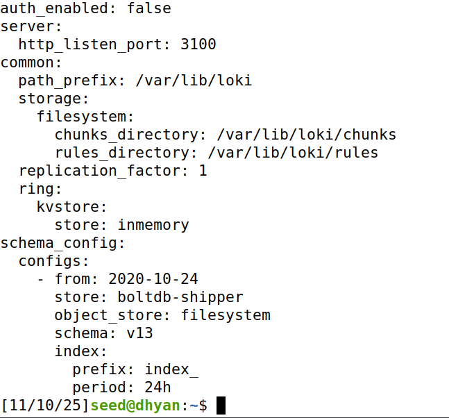

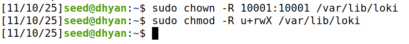

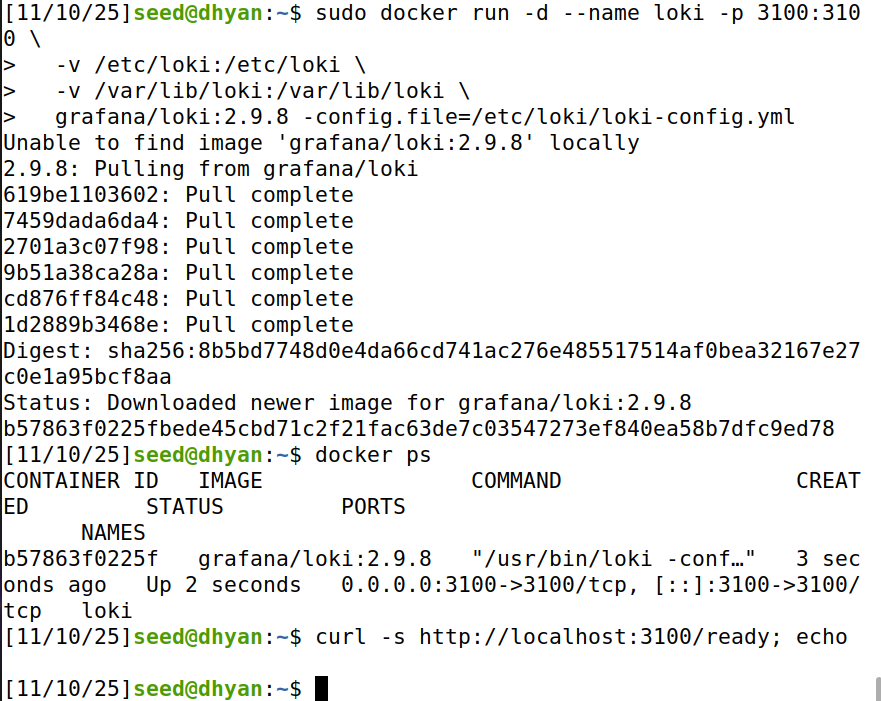

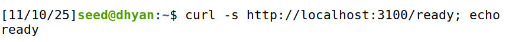

---

## Part 4 — Promtail (Log Shipper)

### Configuration
```bash
sudo mkdir -p /etc/promtail /var/lib/promtail
cat <<'EOF' | sudo tee /etc/promtail/promtail-config.yml
server:
  http_listen_port: 9080
  grpc_listen_port: 0
clients:
  - url: http://localhost:3100/loki/api/v1/push
positions:
  filename: /var/lib/promtail/positions.yaml
scrape_configs:
  - job_name: suricata
    static_configs:
      - targets: [localhost]
        labels:
          job: suricata
          __path__: /var/log/suricata/eve.json
EOF
sudo docker run -d --name promtail -p 9080:9080 \
  -v /etc/promtail:/etc/promtail \
  -v /var/log/suricata:/var/log/suricata:ro \
  -v /var/lib/promtail:/var/lib/promtail \
  grafana/promtail:2.9.8 \
  -config.file=/etc/promtail/promtail-config.yml
```
**Purpose:** Configure and run Promtail to collect Suricata logs and send them to Loki.


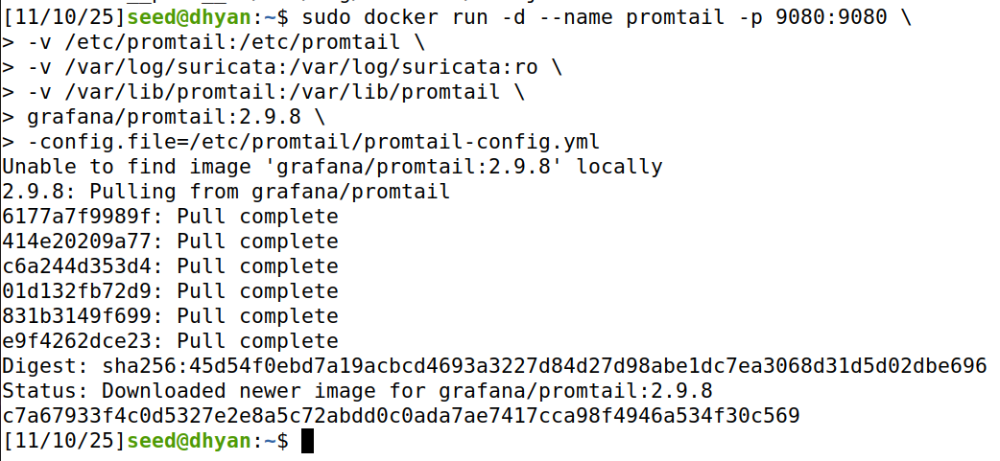

**Q3:** What role does Promtail play compared to Loki?  
**Answer:** Promtail collects log files, attaches labels, and forwards them to Loki. Loki stores and indexes these logs for query and analysis.

**Q4:** Why does Promtail track a “position file”? What problem does it solve?  
**Answer:** The position file tracks how far Promtail has read each log file, preventing duplicates and ensuring no logs are missed during restarts.

---

## Part 5 — LogCLI (Query Tool)
```bash
curl -L https://github.com/grafana/loki/releases/download/v2.9.8/logcli-linux-arm64.zip -o /tmp/logcli.zip
sudo unzip -o /tmp/logcli.zip -d /usr/local/bin
sudo mv /usr/local/bin/logcli-linux-arm64 /usr/local/bin/logcli
sudo chmod +x /usr/local/bin/logcli
logcli --version
logcli labels --addr=http://localhost:3100
logcli query --addr=http://localhost:3100 --limit=10 '{job="suricata"}'
```
**Purpose:** Install and test LogCLI to query logs from Loki.

**Q5:** What labels do you see attached to your logs?  
**Answer:** Labels include `job`, `filename`, `host`, and possibly `path` depending on configuration.

**Q6:** How do labels differ from full-text indexes?  
**Answer:** Labels are structured metadata used for efficient log filtering, while full-text indexes analyze log contents and are resource-intensive.

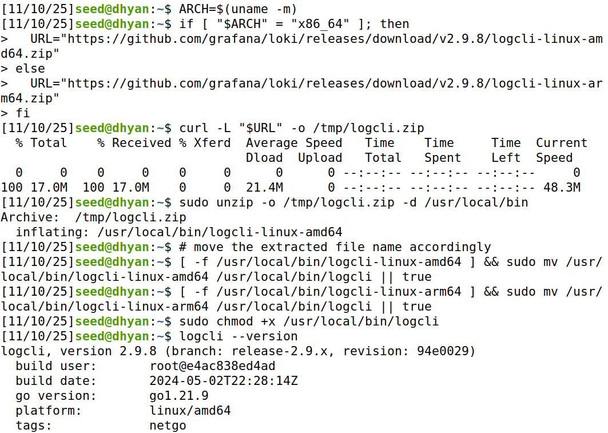

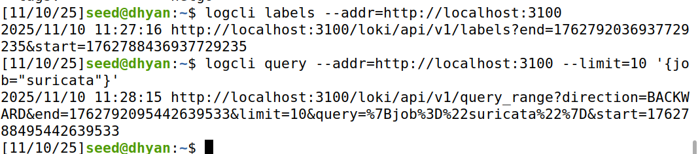

---

## Part 6 — Generate Alerts and Analyze
```bash
echo 'alert http any any -> any any (msg:"LAB UA hit"; http.user_agent; content:"CPS-NETSEC-LAB"; sid:9900001; rev:1;)' | sudo tee -a /etc/suricata/rules/local.rules
sudo systemctl restart suricata
curl -A "CPS-NETSEC-LAB" http://example.com/ || true
```
**Purpose:** Add a custom Suricata rule and trigger it by sending matching HTTP traffic.

**Q7:** What is the command above doing?  
**Answer:** It appends a custom rule to `local.rules` that alerts when the HTTP User-Agent contains `CPS-NETSEC-LAB`.

**Q8:** What alert message appears?  
**Answer:** The alert message is `LAB UA hit`.

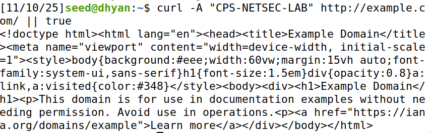

---

## Part 7 — Correlation Challenge
```bash
logcli query --addr=http://localhost:3100 --limit=1000 --since=5m '{job="suricata"} |= "event_type:\"alert\"" | json | line_format "{{.src_ip}}"' | sort | uniq -c | sort -nr | head
```
**Purpose:** Aggregate and identify the top source IPs triggering alerts in the last 5 minutes.

**Q9:** What does this simple command illustrate about correlation and aggregation in SIEMs?  
**Answer:** It demonstrates how SIEM systems aggregate and correlate alert data to identify suspicious or high-volume sources efficiently.

**Q10:** How might a SOC use this information in an investigation?  
**Answer:** SOC analysts can prioritize the most active or suspicious IPs for deeper inspection and threat validation.

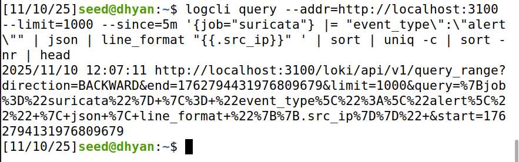

---

## Part 8 — Create and Test Your Own Custom Rule
```bash
echo 'alert http any any -> any any (msg:"Admin path probe"; http.uri; content:"/admin"; http.method; content:"GET"; sid:9900002; rev:1;)' | sudo tee -a /etc/suricata/rules/local.rules
sudo systemctl restart suricata
curl -A "Mozilla/5.0" http://example.com/admin || true
```
**Purpose:** Create a new rule to detect HTTP requests targeting `/admin` paths.

**Q11:** What condition did your rule detect?  
**Answer:** It detected HTTP GET requests containing `/admin` in the URI.

**Q12:** How did you test and confirm that it triggered correctly?  
**Answer:** Sent a test request using `curl` to `/admin` and confirmed the alert `Admin path probe` appeared in Loki via LogCLI.

**Q13:** How would you modify your rule to make it more specific (to reduce false positives)?  
**Answer:** Add conditions such as limiting detection to internal subnets or including hostname checks.

**Q14:** Why is fine-tuning rules important in real-world intrusion detection?  
**Answer:** Fine-tuning reduces false positives, improving alert accuracy and preventing analyst fatigue.

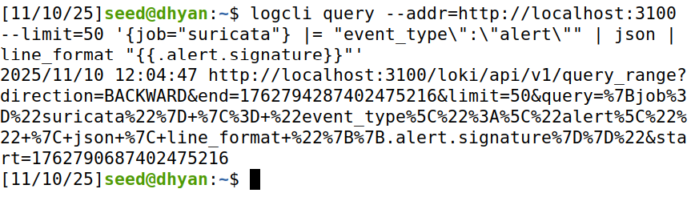

---

## Part 9 — Cleanup
```bash
sudo docker stop promtail loki
sudo docker rm promtail loki
sudo apt purge -y suricata
sudo docker system prune -a -f
```
**Purpose:** Stop and remove containers and purge Suricata to clean up the system.

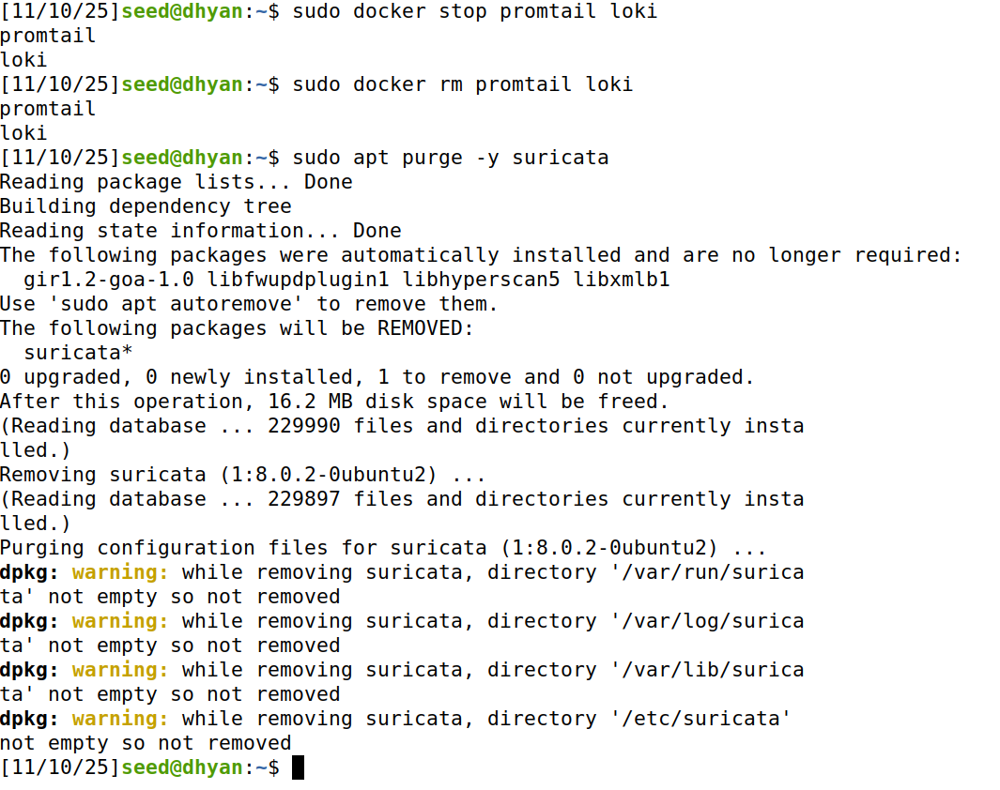

---

## Troubleshooting Notes
- Ensure every rule has a valid `sid` and `rev` to prevent Suricata startup errors.
- Check Loki container permissions if it fails to start.
- Verify Promtail read permissions if no logs appear in Loki.

---

## Summary
This lab demonstrated how to build a lightweight SIEM pipeline using Suricata, Promtail, Loki, and LogCLI. The process highlighted how security events are generated, shipped, stored, and queried. Writing and refining Suricata rules reinforced the importance of precision and correlation in intrusion detection workflows.

---

## References
- Suricata Documentation — https://suricata.io/documentation/  
- Loki Documentation — https://grafana.com/docs/loki/latest/  
- Promtail Documentation — https://grafana.com/docs/loki/latest/clients/promtail/  
- LogCLI Documentation — https://grafana.com/docs/loki/latest/tools/logcli/  
- Docker Documentation — https://docs.docker.com/  
- cURL Manual — https://curl.se/docs/manpage.html

