# Snort Installation and Configuration

This document is part of my **Network Security Home Lab** series.  
It details how I installed, configured, and tested **Snort**, an open-source Intrusion Detection System (IDS), on an Ubuntu virtual machine.  

---

## 1. Update the System
**Commands used:**
```bash
sudo apt update
sudo apt upgrade -y
```
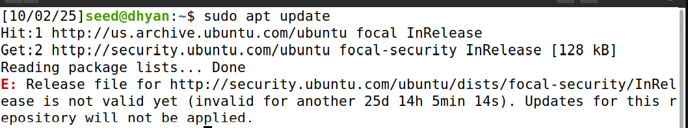
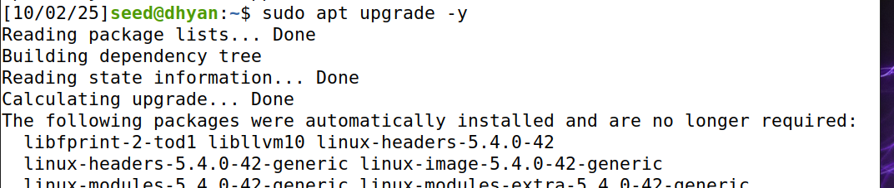

### Purpose:
Keeping the system up to date ensures that all software packages and dependencies are compatible and secure before installing Snort.

### Observation:
The update process completed smoothly without any warnings or errors. This step prepared my system with the latest repository information, making sure Snort and its dependencies could be installed correctly.

---

## 2. Install Snort
**Commands used:**
```bash
sudo apt install snort -y
```
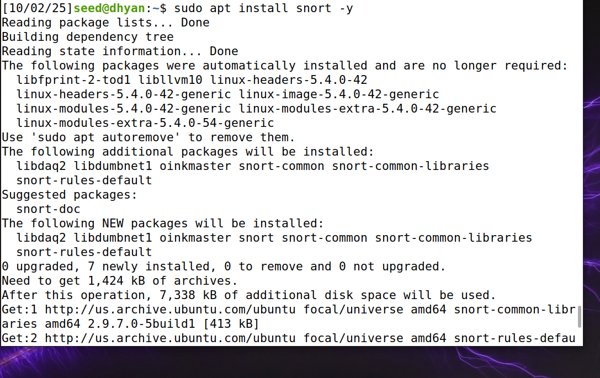


During installation, I was prompted for:
- **Network Interface:** `enp0s3`
- **HOME_NET:** `192.168.1.0/24`
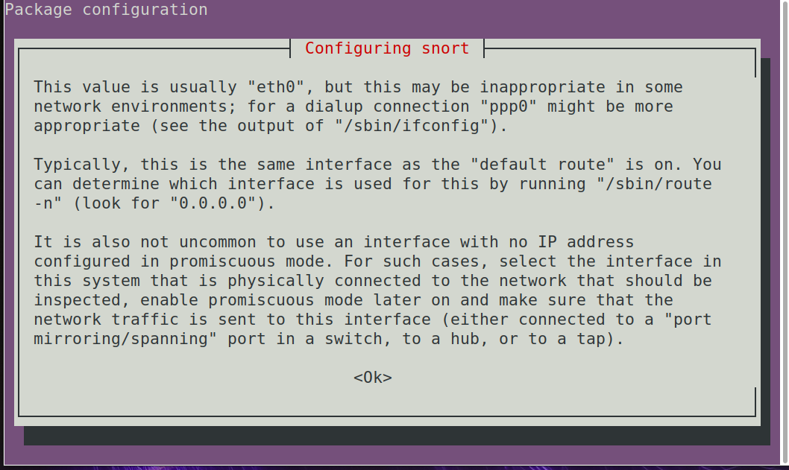

To confirm the correct interface:
```bash
ip a
```
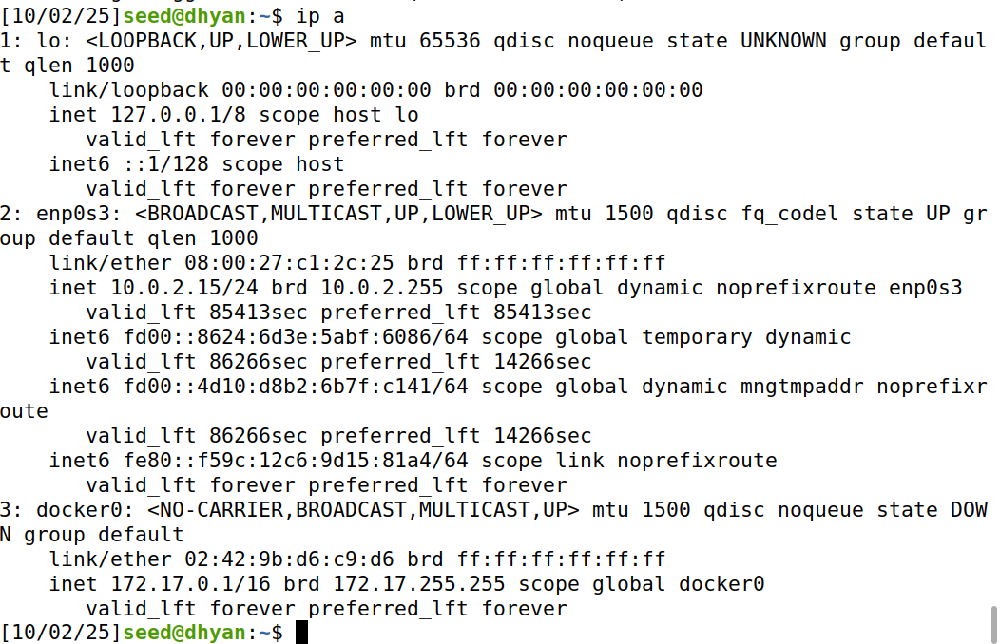

### Purpose:
The goal of this step was to install Snort and configure it with the correct network interface and home network range.

### Observation:
The installation finished successfully. During setup, I selected my active network interface (`enp0s3`) and defined the local subnet as `192.168.1.0/24`. Snort installed without any dependency issues, confirming that the environment was properly set up.

---

## 3. Configure Snort
**Commands used:**
```bash
sudo cat /etc/snort/snort.conf | less
```
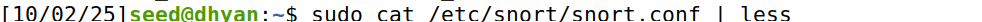
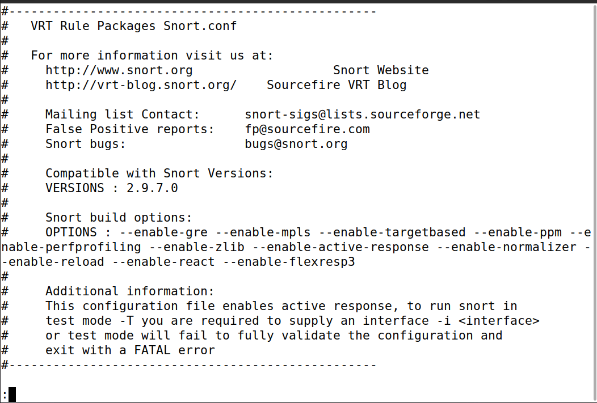


### Purpose:
This step allowed me to review the default Snort configuration file and understand how the network variables are defined.

### Observation:
Upon reviewing the configuration, I found that the HOME_NET variable was set to “any.” For testing, this was ideal because it let Snort analyze all traffic passing through the interface. In a production setup, I would customize it to match my local network for targeted monitoring.

---

## 4. Update and Manage Rules
**Commands used:**
```bash
cd ~
sudo wget --no-check-certificate https://www.snort.org/downloads/community/community-rules.tar.gz
sudo tar -xvzf community-rules.tar.gz
sudo cp community-rules/* /etc/snort/rules/
```
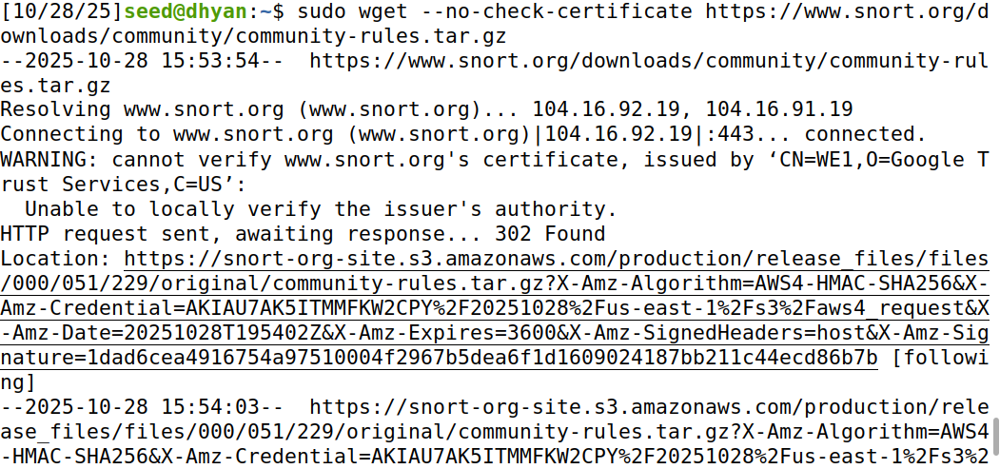
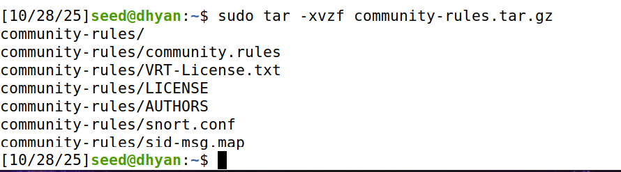
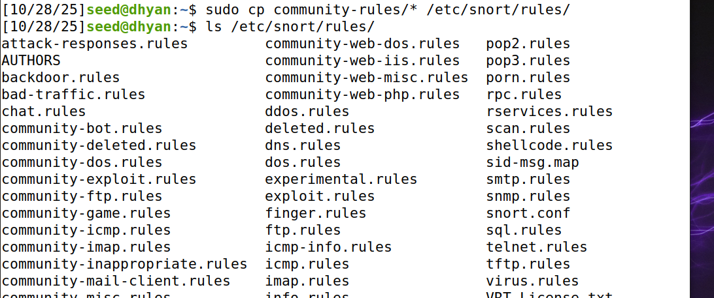

To create a custom rule:
```bash
sudo nano /etc/snort/rules/local.rules
```
Added rule:
```
alert icmp any any -> any any (msg:"ICMP detected"; sid:1000001; rev:1;)
```
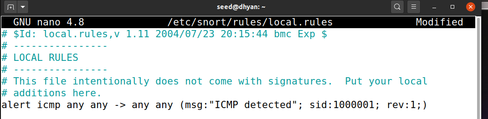
.png)


### Purpose:
The purpose of this step was to enhance Snort’s detection capability by adding community and custom rules that define specific network behaviors to monitor.

### Observation:
I successfully downloaded and extracted the community rules and placed them in Snort’s rules directory. Then, I added my custom ICMP detection rule in the local.rules file. Running a configuration test confirmed that all rules loaded correctly, meaning Snort was ready to detect ICMP packets and other suspicious traffic patterns.

### Question:
Which rules stick out to you? What is the purpose of rules in general?

### Answer:
Among the available rule files, community-scan.rules, community-virus.rules, and community-telnet.rules stood out because they detect specific threats like network scans, malware communication, and unauthorized logins.  
Rules in Snort serve as the foundation of its detection system — they define patterns or conditions that identify suspicious or malicious network activity. In short, rules tell Snort what to watch for and when to trigger an alert.

---

## 5. Test Snort Configuration
**Commands used:**
```bash
sudo snort -T -c /etc/snort/snort.conf
```
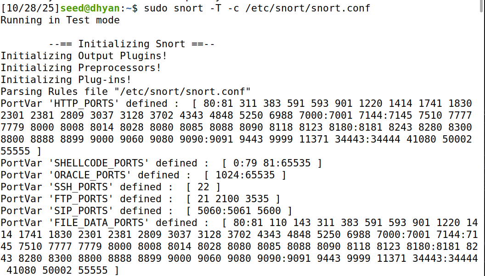
.png)

### Purpose:
To ensure Snort’s configuration file and rule sets are correctly formatted and valid before running it in detection mode.

### Observation:
After running the test, Snort displayed a confirmation message stating that the configuration was successfully validated. No syntax or rule loading errors appeared, which verified that Snort was properly configured and ready for live monitoring.

---

## 6. Running Snort in IDS Mode
**Commands used:**
```bash
sudo snort -c /etc/snort/snort.conf -i enp0s3
ping -c 3 8.8.8.8
```
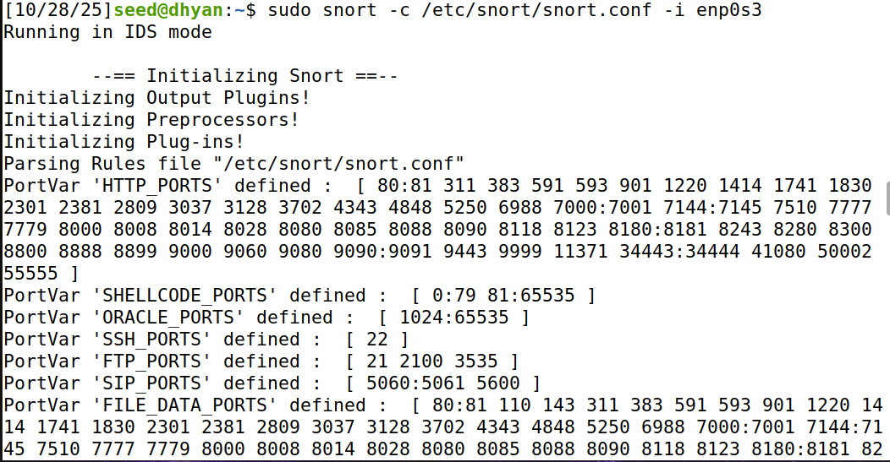
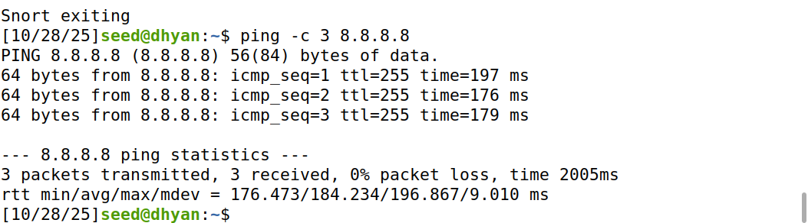

### Purpose:
To launch Snort in live monitoring mode so it can inspect real-time network traffic and log detected activity.

### Observation:
After starting Snort, I generated some network traffic using a ping command. Snort successfully captured the packets and created new log entries under `/var/log/snort`. This confirmed that it was actively monitoring and logging live network data.

---

## 7. View Snort Logs
**Commands used:**
```bash
sudo cat /var/log/snort/snort.log
sudo ls -l /var/log/snort
sudo snort -r /var/log/snort/snort.log
```
.png)
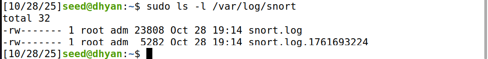
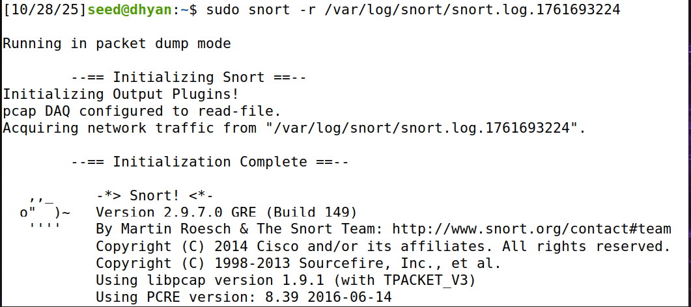


### Purpose:
To examine the logs generated by Snort and verify that detected packets were recorded properly.

### Observation:
When I checked the log directory, I found two files: `snort.log` and another with a timestamp. Viewing them directly showed unreadable binary data, which confirmed Snort was saving raw packet captures. Using `snort -r` allowed me to read the logs in a human-readable format and review the captured packets in detail.

### Question:
What files did you find in /var/log/snort/? Do they contain any content? Why or why not?

### Answer:
I found two log files — `snort.log` and one with a timestamp. When I opened them, they contained binary data because Snort stores raw packet information for accurate replay and analysis. By using `sudo snort -r`, I could view the actual decoded packet information. This confirmed Snort was correctly capturing and storing network activity.

---

## 8. Run Snort as a Daemon
**Commands used:**
```bash
sudo snort -D -c /etc/snort/snort.conf -i enp0s3
```
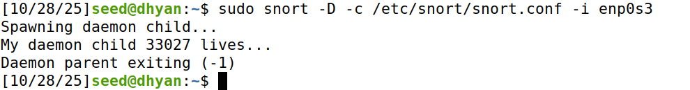

### Purpose:
To run Snort as a background service that continues monitoring even when the terminal is closed.

### Observation:
When I executed the daemon command, Snort started successfully in the background and displayed a process ID (PID). This confirmed that Snort was running continuously as a service, making it easier to maintain long-term network monitoring.

---

## 9. Monitor and Manage Snort Process
**Commands used:**
```bash
top
sudo kill 30034
```
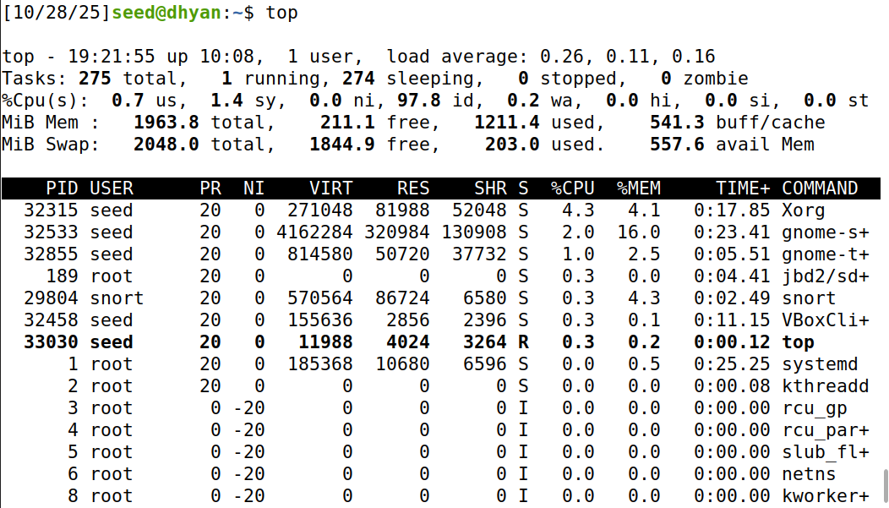


### Purpose:
To verify that Snort is actively running in the background and to learn how to stop the process manually when required.

### Observation:
After starting Snort in daemon mode, I used the `top` command to confirm it was active. Snort appeared with a unique PID, showing it was running properly. I then used the `sudo kill` command to stop it, and after checking again, it was no longer listed — confirming the process had been terminated successfully.

### Question:
If you wanted to stop the Snort process from running, what command would you use?

### Answer:
After verifying Snort’s process ID with the `top` command, I used:
```bash
sudo kill 30034
```
This command stopped the Snort process immediately. It’s the simplest way to manage or terminate Snort when it’s running in the background.

---

## Conclusion:
This lab gave me practical experience with setting up and running Snort as an intrusion detection system. I learned how to install it, configure its rules, and analyze live network traffic. Running Snort in both foreground and background modes helped me understand how IDS tools monitor and log suspicious activity. Overall, the process deepened my understanding of how intrusion detection plays a key role in securing network environments.
